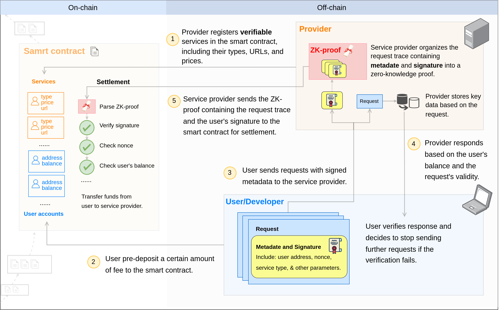

The 0G Compute Network connects AI users and AI service providers, making it easy for AI users to access a wide range of compute and model services. As part of this, the framework is built to provide permissionless settlement between AI users and AI service providers in a fast and trustworthy manner, as required by a fully distributed AI economy.

We integrate various stages of the AI process to make these services both verifiable and billable. This ensures that Service Providers, such as platforms or users offering compute resources, can deliver trusted and accountable solutions.

## Components

**Contract:** This component determines the legitimacy of settlement proofs, manages accounts, and handles service information. It stores variables during the service process, including account information, service details (such as name and URL), and consensus logic.

**Provider:** The owners of AI models and hardware who offer their services for a fee.

**User:** Individuals or organizations who use the services listed by Service Providers. They may use AI services directly or build applications on top of our API.

## Process Overview

The 0G Compute Network implements the following workflow:

1. **Service Registration:** Providers register their services' types, URLs, and prices in the smart contract.
2. **Fee Staking:** Users deposit a certain amount into the smart contract for service fees. If the accumulated charges from user requests exceed their deposit, the provider will stop responding.
3. **Request Submission:** Users or developers send requests, along with metadata and signatures, to the Service Provider.
4. **Provider Response:** Providers respond based on the user's balance and the request's validity.
5. **Settlement and Verification:** Providers generate a [zero-knowledge proof (ZK-proof)](https://github.com/0glabs/0g-zk-settlement-server?tab=readme-ov-file) and submit it to the smart contract for verification and settlement.
6. **User Verification:** Users verify the Service Provider's response and can stop requests if the verification fails.

This brief overview introduces the foundational workflow. For more detailed steps, please refer to the full documentation.

## Get Involved

If you're interested in becoming a **Service Provider**, please refer to [the Provider section](./provider.md) for detailed guidelines and requirements.

If you wish to leverage provider services to develop your own projects, relevant resources are available in [the Developer SDK section](./sdk).

For those looking to use the 0G Compute Network to access AI services, more information can be found in [the Marketplace section](../marketplace.md).
